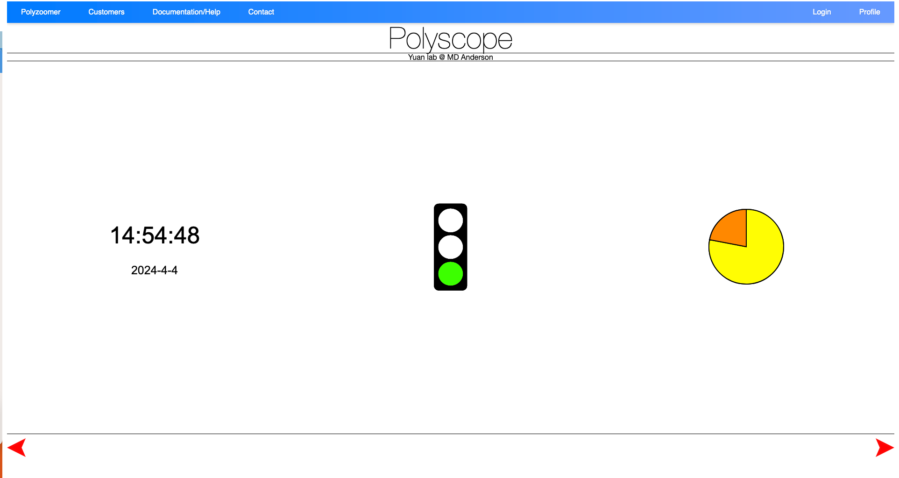

# Welcome to Polyscope Documentation

## Introduction

### What?

PolyScope is a web application for image sharing and annotation collection for digital pathology. Our aim is to connect our target users, pathologists, to data scientists, who are developing machine learning (ML) models for cancer diagnosis. In PolyScope, large whole-slide images can be explored in a web browser with fast response and a simplistic user interface. It supports single-cell annotations and tissue segmentation that we can collect to train ML models or visualize to validate the prediction of these models. 

### Why?

PolyScope supports a wide range of image formats. Sharing a view of a slide can be as easy as sharing a URL link. By using PolyScope, you have the chance to work with its developers, a team of data scientists and pathologists, and collaborate with them first-hand to form collobration and publish findings together, as opposed to developers of other software whom might not have the expertise in cancer research. 

Compared with existing software such as QuPath, PolyScope doesn't require installation or local storage at the users end. PolyScope can be accessed from almost all modern web browsers, including mobile devices. 

### Who?

PolyScope was originally developed by researchers in Dr. Yinyin Yuan's lab at [The Institute of Cancer Research, London](https://www.icr.ac.uk/). After Dr. Yuan moved to The University of Texas MD Anderson Cancer Center, we continue adding to its features at [Yuan Lab](https://www.mdanderson.org/research/departments-labs-institutes/labs/yuan-laboratory.html). This version is built upon the public [PolyScope repository](https://github.com/polyscope/polyscope) where Sebastian Schmittner was the main contributor. Current developers include: [Simon Castillo](https://www.linkedin.com/in/simon-castillo-95b08b3a/), [Yasin Shokrollahi](https://www.linkedin.com/in/yshokrollahi/), [Zhuohe Liu](https://www.linkedin.com/in/zhuoheliu/), etc., with users from both within MD Anderson and outside collaborators.

To report bugs, request features, or ask questions, please contact developers through their MD Anderson emails or create an issue in the [PolyScope repository](https://github.com/MDA-Yuan-Lab/polyscope/issues).

### How?

PolyScope home page is at [placeholder](#). To view a demonstrative slide, please check [placeholder](#). To create an account, please see [placeholder](#). You may also view the YouTube tutorial [placeholder](#).

### Limitations

We are working to add the support for non-composite multiplex immunofluorescence (mIF) images. 

### Disclaimer

We are working with MD Anderson to ensure the safety and security of the data. User access are managed. However, as patient data are involved, we recommend checking with your institutions policy and compliance before uploading data to PolyScope. Deidentification is strongly recommended and please also consider if material transfer agreement (MTA) is needed. All data are stored in secure MD Anderson servers. 

We are a non-profit organization. Despite that we are actively maintaining the software, we cannot guarantee the availability of the service. In addition, we will try to acknowledge all the issue reported and feature requested, but we cannot guarantee the timeline of the development. For urgent issues, please contact the developers directly. We are not responsible for any loss of data or any other damages caused by the use of this software.

This application is not approved for clinical use or primary diagnosis. 

We are currently working to potentially open-source the application and accept external contributions. For now, please contact the developers if you want to contribute to the source code. 

### Acknowledgement

We thank Dr. Yinyin Yuan for her leadership and support. We gratefully acknowledge the support from MD Anderson Cancer Center, especially Gaston Benavides from the Oncology Care & Research Information Systems department and John Wood from the Enterprise Development & Integration department. We thank [Nick Trahearn](mailto:nick.trahearn@icr.ac.uk) from ICR who helped on transition the software from ICR to MD Anderson. 

## Pages
PolyScope has three main pages: (1) **index page**, which enables user to select files to be preprocessed; (2) **user page**: this page let user manage their imported slides and generate 'Polyzoomer' slide views; (3) **Polyzoomer page**: this is the page to create annotations and view statistics for each slide or combination of slide views. 

### Index Page
The index page consists of three views: (1) **summary**, (2) **file browser**, and (3) **job status**.

When login to the index page, you will first see the **summary view**. The clock indicates periodic page refresh, the traffic light indicates CPU workload, and the pie chart indicates available storage. The view will display briefly and then turns to the file browser view. Use the red arrow on the bottom right to switch from summary view to file browser view, and the arrow on the bottom left to switch from file browser view to summary view.

**File browser** is where you select files to be imported and preprocessed. To select files, first click on the list on the left to select a drive, after which the files within will be listed on the treeview to the right. Select one or mulitple files using the checkboxes, and click the yellow 'Polyzoomer' button on the lower left to submit the files for batch processing. 

**Job status** view displays the queue of files to be processed. If you see red 'Please enter your email' label next to the job, click it to type in your username (i.e. email) in the popup onscreen keyboard. After hitting 'Return' or press 'Enter' key, you will see the green 'Email Ok!' label, indicating the email is accepted. You will see the job status evolve from checksum, pending, upload, uploading, uploaded, inQueue, processing, finished, emailSent, all the way to readyToBeRemoved. Normally, preprocessing of a file takes somewhere around 1 to 10 minumtes. After the job is finished, it will be removed from the list. Processed files can then be viewed in the **user page**.

### User Page
From the **index page**, click 'Customers' in the navigation bar to go to the user page. You have access only to your own user directory under `.../customers/<your_email>` where `<your_email>` is your email address/username where `@` and `.` is replaced by `-`. For example, for `jsmith1@mdanderson.org`, the user page is located at `.../customers/jsmith1-mdanderson-org`.

Use the buttons to the left to organize the imported files. From top to bottom: (1) delete selected file(s); (2) create new folders; (3) sort file list. To move file(s) to a folder, either drag the selected files to the destination folder, or use context menu to 'copy' or 'cut' and then 'paste'. 

A 'Polyzoomer' view may contain one slide/file, or more than one, which is called 'multizoomer'. In a 'multizoomer' view, the display areas of each file are synchronized across user's pan and zoom actions. To create a multizoomer view, drag one or more files to the right side of the user page. When all files are added, click the 'multizoom' button on the left to create the view. This will be added to the list of files on the left. Double click on the thumbnail of a 'Polyzoomer' or 'multizoomer' to open them in the **Polyzoomer page**.

Note that changes (annotation edits) to the underlying polyzoomer files will propogate to the dependent multizoomer views. 

### Polyzoomer Page
The main goal of the **Polyzoomer page** is to let users view and annotate slides. Before you start, make sure you choose a set of annotation shapes and colors to be used for each semenatic class to ensure consistency. Once an annotation is created, it cannot be edited (shape or color) unless it is deleted and recreated.

**View Controls**

* Click `+` or `-`, press `-` or `=` keys, or use mouse scroll to zoom. Double left click to zoom in. 
* Press arrow keys or `wasd` keys or drag with left mouse button to pan.
* Click the house icon to reset the view. 
* Click 'toggle full page' to display the current slide in full screen.
* Click `⮣` or `⮢` icons to rotate the slide 90 degrees clockwise or counterclockwise, respectively.

**Annotation Controls**

* Click `□` icon and drag on the slide using left mouse button to add a rectangle annotation.
* Click `○` icon and drag on the slide using left mouse button to add an ellipse annotation.
* Click `⟋` icon and drag on the slide using left mouse button to add a line segment annotation.
* Click `⭩` icon and drag on the slide using left mouse button to add an arrow annotation from tail to head.
* Click `T` icon to add a text annotation. In the popup window, type in the text after the prompt 'Please enter the annotation text'. Click 'OK' to add the annotation.
* Click the pen icon and drag on the slide using left mouse button to draw a freehand annotation.
* Click `.` icon and left click on the slide to add a point annotation.
* Click the 'select color' icon and click on the popup color swatches to change the annotation color. 

Note that once an annotation is created, it cannot be edited (shape or color) unless it is deleted and recreated. To delete an annotation, double click on it and click 'Yes' in the popup message box. Annotations are automatically saved and you can safely close the browser window whenever you want.

**Download Annotations**

Click the 'Download Annotations' green button on top of the page to download the annotations in .txt format. In the txt, we save the following properties of each annotation, as ordered by column: 

* Annotation state: 0 = deleted, 1 = active. 
* Ordered index: started from one. 
* Shape type: 0 = line segment, 1 = arrow, 2 = rectangle, 3 = ellipse, 4 = freehand, 5 = text, 6 = point.
* Coordinates: An array of (x, y) values, normalized to 0 to 1 according to the area of the slide. For text annotation, the text is saved at the end of the coordinate array. 
* Ccolor: in hex such as #ffffff. 
* Created date and time: in the format of d/m/yyyy/HH:mm:ss in local time zone.

**Statistics**

At the bottom of the page, you can view a real-time summary of created annotations. The statistics include counts of each annotation types. 

**Link Sharing**

You can bookmark and share the URL of the current slide view with others for collaboration. An exemplar Polyzoomer/Multizoomer link might look like this: `.../customers/jsmith1-mdanderson-org/Path000001_202402061731/page/test001/index.html`. 
