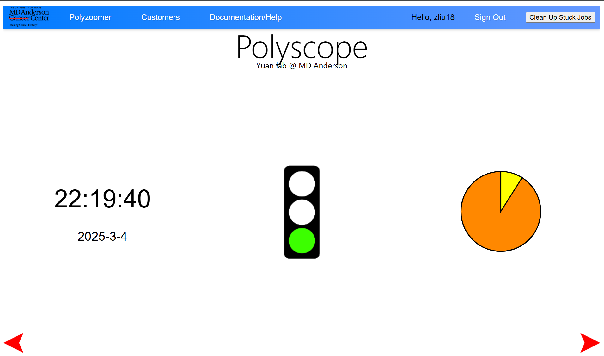
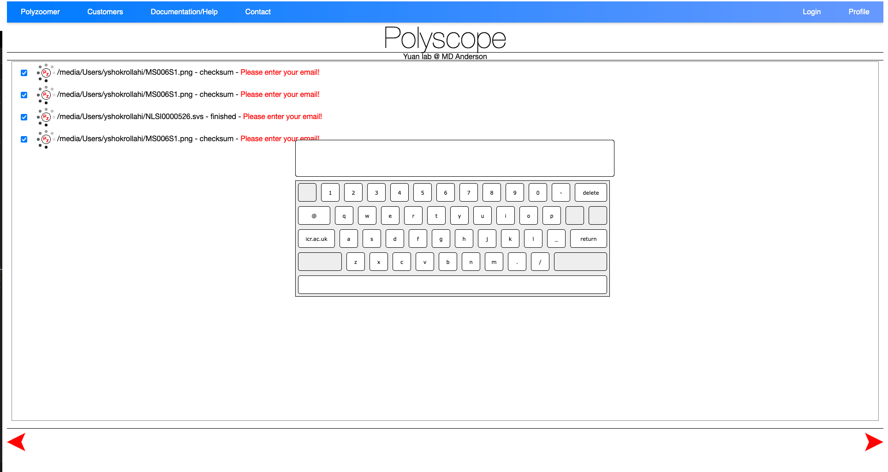
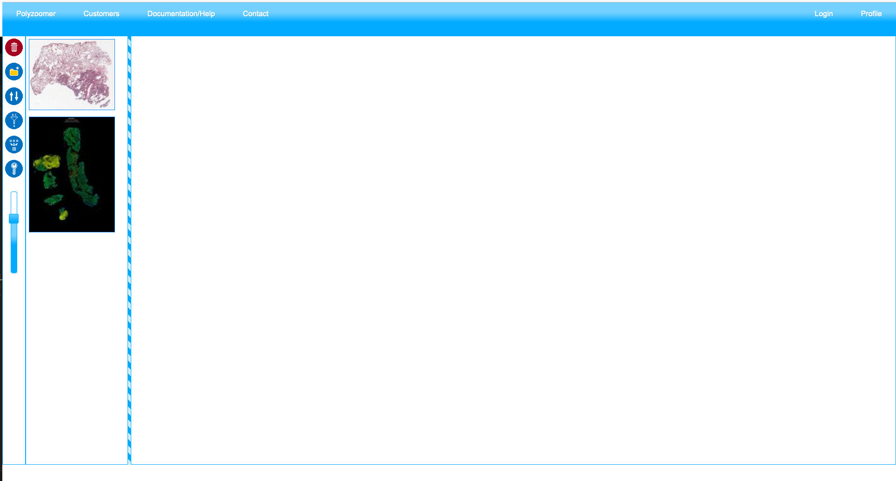
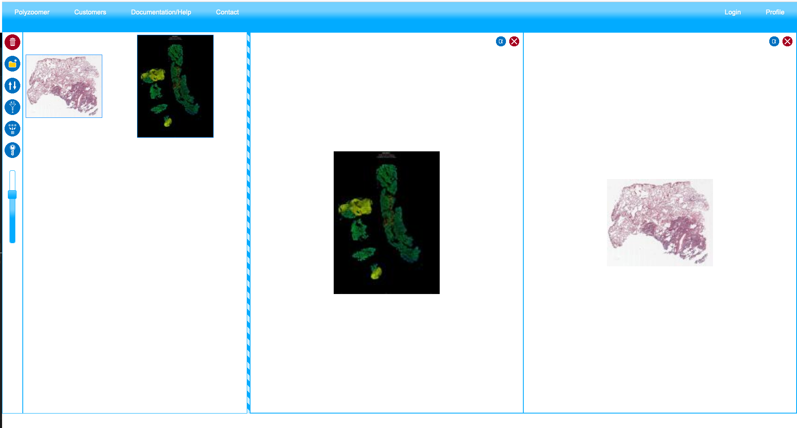
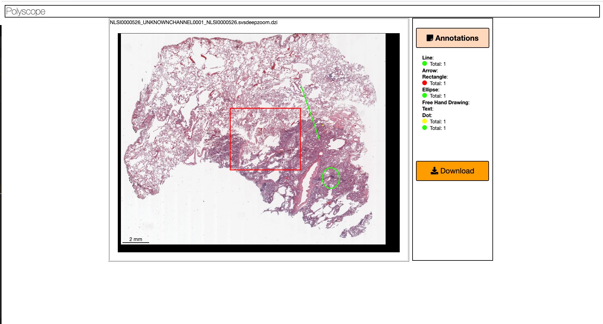

# Pages

Polyscope has three main pages: 

1. [**Index Page**](#index-page), which enables user to select files to be preprocessed; 
2. [**User Page**](#user-page): this page let user manage their imported slides and generate slide views; 
3. [**Slide Page**](#Slide-page): this is the page to create annotations and view statistics for each slide or combination of slide views. 

## Index Page

### Login

Navigate to the index page of Polyscope [https://polyscope.mdanderson.org/](https://polyscope.mdanderson.org/). Most broswers are supported including Chrome, Firefox, Safari, and Edge. Polyscope is accessible both within and outside MD Anderson. 

You need to log in to upload data and generate slide views. To log in, enter your MD Anderson username and password. You will be automatically logged out after 45 minutes of inactivity. 

After login, the index page will show either of the following three views: (1) [**Splash Screen**](#splash-screen), (2) [**File Browser**](#file-browser), and (3) [**Job Status**](#job-status).

### Splash Screen

After login, you will first see the **Splash Screen**. The clock indicates periodic page refresh, the traffic light indicates CPU workload, and the pie chart indicates available storage. The view will display briefly and then turns to the [**File Browser**](#file-browser) view. Use the red arrows on the bottom to switch between the three views. 

### File Browser

**File Browser** is where you select files to be imported and preprocessed to create slide views. To select files, first click on the list on the left to select a drive, after which the files within will be listed on the treeview to the right. Select one or mulitple files using the checkboxes, and click the yellow 'Polyzoomer' button on the lower left to submit the files for batch processing. 

 Your user folder is located at `/rsrch9/home/plm/polyscope/media/Users/`. You can add data by either copying from the research drive or uploading files directly from your browser. Folder and file names must not contain spaces (` `). 

To upload files, click the green upload icon next to the subfolder. Supported formats include `svs`, `ndpi`, `tiff`, `jpg`, and `png`, with a file size limit of **5 GB**. Multiple files can be uploaded concurrently. Currently, adding new folders, renaming, or deleting folders and files is not supported.

### Job Status

**Job status** view displays the queue of files to be processed. If you see red 'Please enter your email' label next to the job, click it to type in your username (i.e. email) in the popup onscreen keyboard. After hitting 'Return' or press 'Enter' key, you will see the green 'Email Ok!' label, indicating the email is accepted. You will see the job status evolve from checksum, pending, upload, uploading, uploaded, inQueue, processing, finished, emailSent, all the way to readyToBeRemoved. Normally, preprocessing of a file takes somewhere around 1 to 10 minumtes. After the job is finished, it will be removed from the list. Processed files can then be viewed in the [**User Page**](#user-page).

## User Page

Link: `https://polyscope.mdanderson.org/customers/<your_email>/`

From the **index page**, click 'Customers' in the navigation bar to go to the user page. You have access only to your own user directory under `.../customers/<your_email>` where `<your_email>` is your email address/username where `@` and `.` is replaced by `-`. For example, for `jsmith1@mdanderson.org`, the user page is located at `.../customers/jsmith1-mdanderson-org/`.

Use the buttons to the left to organize the imported files. From top to bottom: (1) delete selected file(s); (2) create new folders; (3) sort file list. To move file(s) to a folder, either drag the selected files to the destination folder, or use context menu to 'copy' or 'cut' and then 'paste'. 

A 'Polyzoomer' view may contain one slide/file, or more than one, which is called 'Multizoomer'. In a 'Multizoomer' view, the display areas of each file are synchronized across user's pan and zoom actions. To create a Multizoomer view, drag one or more files to the right side of the user page. When all files are added, click the 'multizoom' button on the left to create the view. This will be added to the list of files on the left. Double click on the thumbnail of a 'Polyzoomer' or 'Multizoomer' to open them in the [**Slide Page**](#slide-page).

Note that changes (annotation edits) to the underlying polyzoomer files will propogate to the dependent Multizoomer views. 

## Slide Page
The goal of the **Slide Page** is to let users view and annotate slides. This page can be configured to two modes: 

* **Polyzoomer**: referring to a single slide view.
* **Multizoomer**: referring to a combination of multiple slide views. 

Before you start, make sure you choose a set of annotation shapes and colors to be used for each semenatic class to ensure consistency. Once an annotation is created, it cannot be edited (shape or color) unless it is deleted and recreated.

### View Controls

On the top left of the slide view, you will find the following view control buttons: 

* Click `+` or `-`, press `-` or `=` keys, or use mouse scroll to zoom. Double left click to zoom in. 
* Press arrow keys or `wasd` keys or drag with left mouse button to pan.
* Click the house icon to reset the view. 
* Click 'toggle full page' to display the current slide in full screen.
* Click `⮣` or `⮢` icons to rotate the slide 90 degrees clockwise or counterclockwise, respectively.

### Annotation Controls

On the lower right of the slide view, you will find the following annotation control buttons:

* Click `□` icon and drag on the slide using left mouse button to add a rectangle annotation.
* Click `○` icon and drag on the slide using left mouse button to add an ellipse annotation.
* Click `⟋` icon and drag on the slide using left mouse button to add a line segment annotation.
* Click `⭩` icon and drag on the slide using left mouse button to add an arrow annotation from tail to head.
* Click `T` icon to add a text annotation. In the popup window, type in the text after the prompt 'Please enter the annotation text'. Click 'OK' to add the annotation.
* Click the pen icon and drag on the slide using left mouse button to draw a freehand annotation.
* Click `.` icon and left click on the slide to add a point annotation.
* Click the 'select color' icon and click on the popup color swatches to change the annotation color. 

Note that once an annotation is created, it cannot be edited (shape or color) unless it is deleted and recreated. To delete an annotation, double click on it and click 'Yes' in the popup message box. Annotations are automatically saved and you can safely close the browser window whenever you want.

### Download Annotations

Click the 'Download Annotations' green button on top of the page to download the annotations in .txt format. In the txt, we save the following properties of annotations, one row per annotations. The description of columns ordered from left to right are: 

* Annotation state: 0 = deleted, 1 = active. 
* Index: started from one, ordered by creation or deletion time. 
* Shape type: 0 = line segment, 1 = arrow, 2 = rectangle, 3 = ellipse, 4 = freehand, 5 = text, 6 = point.
* Data, depending on the shape type: 
  * Line segment, arrow: a list of 2 (x, y) coordinates denoting start and end points, e.g. `[(0.1,0.2),(0.3,0.4)]`.
  * Rectangle, ellipse: a list of 2 (x, y) coordinates denoting the top-left and bottom-right corners, e.g. `[(0.1,0.2),(0.3,0.4)]`.
  * Freehand: a list of (x, y) coordinates of variable length, e.g. `[(0.1,0.2),(0.3,0.4),...]`.
  * Text: a list of a (x, y) coordinate and text string, e.g. `[(0.1,0.2),'text']`.
  * Point: a list of 2 (x, y) duplicated coordinates, marking the point location, e.g. `[(0.1,0.2),(0.1,0.2)]`.
  * Note that coordinate values for **both x and y axes** are normalized to 0 to 1 according to the **width** of the slide.
* Color: in hex such as #ffffff. 
* Created date and time: in the format of `d/m/yyyy/HH:mm:ss` in local time zone.

Since the annotation file does not contain corresponding slide information, it is recommended to rename the file immediately after downloading. Annotations can be downloaded at any time and multiple times if needed. 

### Statistics

At the bottom of the page, you can view a real-time summary of created annotations. The statistics include counts of each annotation types. 

### Link Sharing

You can bookmark and share the URL of the current slide view with others for collaboration. An exemplar Polyzoomer/Multizoomer link might look like this: `.../customers/jsmith1-mdanderson-org/Path000001_202402061731/page/test001/index.html`. You may omit the `index.html` part.
