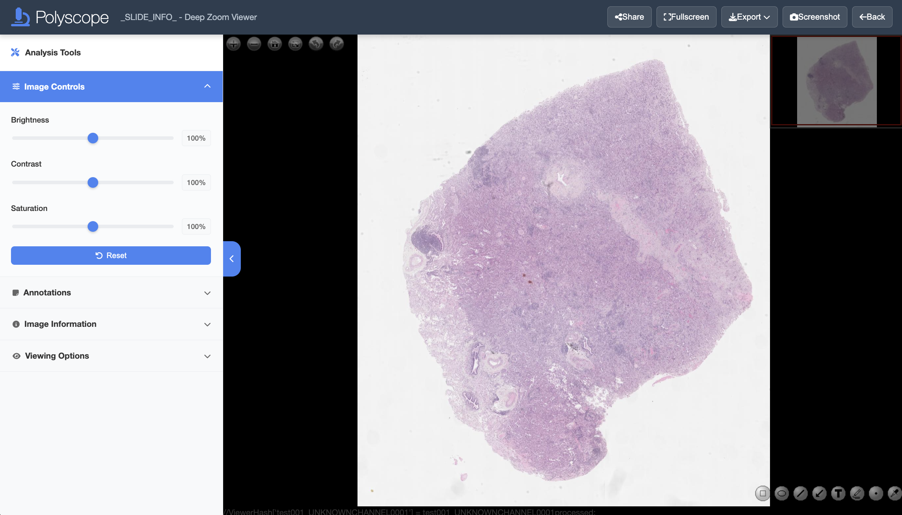

# Pages > Image

!!! abstract
    Image page offers interactive view of the image and enables annotation collection.

## View Images

### View Modes

The goal of the **Image Page** is to let users view and annotate images. This page can be configured to two modes: 

* **Polyzoomer**: referring to a single image view.
* **Multizoomer**: referring to a combination of multiple image views. 

Before you start, make sure you choose a set of annotation shapes and colors to be used for each semenatic class to ensure consistency. Once an annotation is created, it cannot be edited (shape or color) unless it is deleted and recreated.



### View Controls

You can control the displayed image view by mouse or keyboard. On the top left of the slide view, you will find the following view control buttons:  

* Click :material-plus-circle: or :material-minus-circle: or use mouse scroll to zoom. Double left click to zoom in. 
* Drag with left mouse button to pan. 
* Click :fontawesome-solid-house: to reset the view. 
* Click :material-fullscreen: to display the current slide in full screen.
* Click :material-arrow-right-top: or :material-arrow-left-top: icons to rotate the slide 90 degrees clockwise or counterclockwise, respectively.

In addition, keyboard offers the following alternative view controls: 

* Press ++equal++ or ++minus++ to zoom in and out, respectively. 
* Press ++arrow-up++, ++arrow-down++, ++arrow-left++, ++arrow-right++ or ++w++, ++a++, ++s++, ++d++ keys to pan.
* Press ++0++ to reset the view.

To adjust the displayed image brightness, contrast, and saturation, using the sliders on the **Analysis Tools** side panel. Click the **Reset** button to reset the properties.

### Download and Copy View

To download the currently displayed image view to an image file, click the **:octicons-download-24:Export** button on the top right and select the **:fontawesome-solid-image:Export Image** option. Alternatively, right click over the image area and select the **Save image As...** context menu option. Supported file formats is `png`. 

You can also copy the current view by selecting the **Copy Image** menu option in the right click context menu. 

## Annotation

### Create Annotations
On the lower right of the slide view, you will find the following annotation control buttons:

* Click :material-crop-square:{ title="Draw rectangle" } and drag on the slide using left mouse button to add a rectangle annotation.
* Click :material-ellipse-outline:{ title="Draw ellipse" } and drag on the slide using left mouse button to add an ellipse annotation.
* Click `⟋`{ title="Draw line" } and drag on the slide using left mouse button to add a line segment annotation.
* Click :material-arrow-bottom-left-thin:{ title="Draw arrow" } and drag on the slide using left mouse button to add an arrow annotation from tail to head.
* Click :material-format-text:{ title="Add text" } to add a text annotation. In the popup window, type in the text after the prompt 'Please enter the annotation text'. Click 'OK' to add the annotation.
* Click :material-pen:{ title="Draw freehand polygon" } and drag on the slide using left mouse button to draw a freehand annotation.
* Click `.`{ title="Draw point" } and left click on the slide to add a point annotation.
* Click the :material-eyedropper:{ title="Select color" } and click on the popup color swatches to change the annotation color. 

Note that once an annotation is created, it cannot be edited (shape or color) unless it is deleted and recreated. 

!!! tip
    Annotations are automatically saved and you can safely close the browser window whenever you want.

### Delete Annotations

To delete an annotation, double click on it and click 'Yes' in the popup message box. Multiple annotations must be deleted one by one.

Deletion cannot be undone by the user. However, deleted annotations are recorded and can be retrieved for later analysis if necessary.

### Download Annotations

Annotations created in Polyscope can be exported to common [formats](#annotation-format) such as CSV and JSON, as well as Polyscope TXT format. Click the **:octicons-download-24:Export** button on the top right and select **Annotations TXT** menu option to download the annotations in Polyscope .txt format. Other formats follow similarly. Annotations can be downloaded at any time and multiple times if needed. 

!!! important
    Since the annotation file does not contain corresponding source image information, it is recommended to name the file properly with relevant information. 

### Annotation Format

#### TXT Annotation Format

We save the following properties of annotations, one row per annotations. The description of columns ordered from left to right are: 

* Annotation state: `0` = deleted, `1` = active. 
* Index: started from one, ordered by creation or deletion time. 
* Shape type: `0` = line segment, `1` = arrow, `2` = rectangle, `3` = ellipse, `4` = freehand, `5` = text, `6` = point.
* Data, depending on the shape type: 
  * Line segment, arrow: a list of 2 (x, y) coordinates denoting start and end points, e.g. `[(0.1,0.2),(0.3,0.4)]`.
  * Rectangle, ellipse: a list of 2 (x, y) coordinates denoting the top-left and bottom-right corners, e.g. `[(0.1,0.2),(0.3,0.4)]`.
  * Freehand: a list of (x, y) coordinates of variable length, e.g. `[(0.1,0.2),(0.3,0.4),...]`.
  * Text: a list of a (x, y) coordinate and text string, e.g. `[(0.1,0.2),'text']`.
  * Point: a list of 2 (x, y) duplicated coordinates, marking the point location, e.g. `[(0.1,0.2),(0.1,0.2)]`.
  * Note that coordinate values for **both x and y axes** are normalized to 0 to 1 according to the **width** of the slide.
* Color: in hex such as `#ffffff`. 
* Created date and time: in the format of `d/m/yyyy/HH:mm:ss` in local time zone.

#### CSV Annotation Format

TBD

#### JSON Annotation Format

TBD

#### Annotation File Examples

For example, different formats of the same rectangle annotation are shown below: 

=== "TXT"

    ```
    1,1,2,[(0.1,0.2),(0.3,0.4)],#ff0000,1/8/2025/14:35:12
    ```

=== "CSV"

    ``` csv
    
    ```

=== "JSON"

    ``` json
    {}
    ```

### Annotation Statistics

In the **Annotation** section of the **Analysis Tools** side panel, you can view a real-time summary of created annotations. The statistics include counts of each annotation types. 

## Link Sharing

You can bookmark and share the URL of the current image page with others for collaboration. The **:material-share-variant:Share** button on the top right offers convenient sharing options. 

!!! example
    A Polyzoomer/Multizoomer link might look like this: `.../customers/jsmith1-mdanderson-org/Path000001_202402061731/page/test001/index.html`. You may omit the `index.html` part.

!!! warning
    The link is publicly accessible, so it is advisable to keep it confidential.

!!! tip
    If you need to share an image with multiple independent users, consider creating multiple Polyzoomers/Multizoomers from the same file.