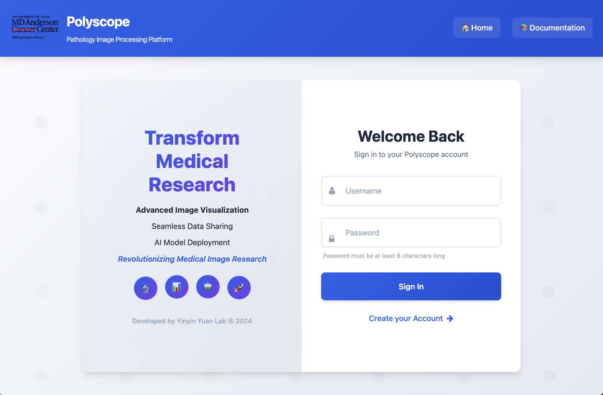

# Pages > Login

!!! abstract
    Login page grants user access to Polyscope, with support for MD Anderson Cancer Center single sign-on (SSO). 

Polyscope is accessible both within and outside MD Anderson Cancer Center. While Polyscope is hosted on secure servers within MD Anderson Cancer Center, VPN connection is not necessary to access Polyscope outside the internal network. Polyscope supports most modern broswers, including Chrome, Firefox, Safari, and Edge. 

The login page is the gateway to the Polyscope application when users first visit the site at [https://polyscope.mdanderson.org/](https://polyscope.mdanderson.org/). Logging in is required except to view the documentation and viewing shared [Polyzoomer pages](pages_image.md#link-sharing). 

To log in, enter your MD Anderson username and password and click **Sign In**. After successful log-in, you will be redirected to the [Index page](pages_index.md).

!!! tip
    You will be automatically logged out after 45 minutes of inactivity. 

