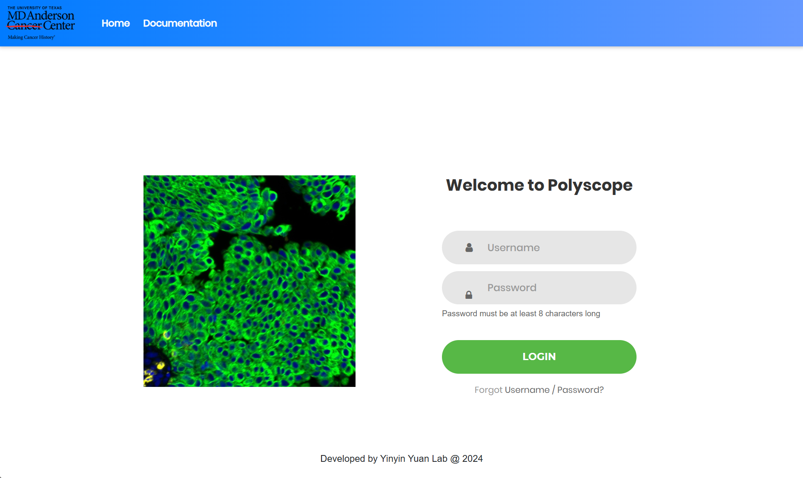
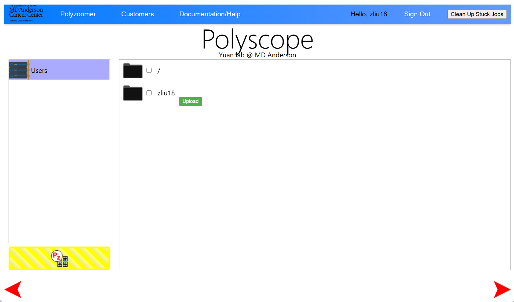

# Tutorial 1: Login, Navigate, Create Polyzoomer

This tutorial serves as a quick guide for using Polyscope. For more detailed information, refer to the [Documentation](pages.md).

## Login to Polyscope

[Polyscope](https://polyscope.mdanderson.org/) is accessible both within and outside MD Anderson. To log in, enter your MD Anderson username and password. You will be automatically logged out after 45 minutes of inactivity. If you encounter issues, try refreshing the page or re-logging in at the index page.

## Navigate Folders and Upload/Copy Data

After logging in, a splash screen will appear before entering the folder navigation page. Your user folder is located at `/rsrch9/home/plm/polyscope/media/Users/`. You can add data by either copying from the research drive or uploading files directly from your browser. Folder and file names must not contain spaces. 

To upload files, click the green upload icon next to the subfolder. Supported formats include `svs`, `ndpi`, `tiff`, `jpg`, and `png`, with a file size limit of **5 GB**. Multiple files can be uploaded concurrently. Currently, adding new folders, renaming, or deleting folders and files is not supported.

## Create Polyzoomer from File

A Polyzoomer is an interactive view of an uploaded slide, which must be created before viewing. Ensure that file names are properly formatted and that **PHI is removed** before proceeding. Select one or more files and click the yellow button to create a Polyzoomer. When prompted, provide your full MD Anderson email. 

You can use the lower red arrows to navigate between the Polyzoomer queue and the data explorer. Processing takes approximately 10 to 30 minutes, and the queue is shared with other users. Once a Polyzoomer is created, the original source files can be deleted. After refreshing, there is no need to enter your email again.

## Customers Page and Open Polyzoomer

The Customers page lists all created Polyzoomers for each user. Hovering over a thumbnail will display the slide name (**TBD** feature). A slider allows you to adjust the thumbnail size, and double-clicking will open a Polyzoomer. 

Folders can be created to organize Polyzoomers by dragging them into place, but folder renaming is **not** currently supported. It is also possible to create a **Multizoomer** from multiple Polyzoomers, enabling multi-view interaction (see [**Tutorial 3**](tutorial_multizoomer.md)). If you need to delete a Polyzoomer, you must request assistance from an admin.

## Explore Polyzoomer

A Polyzoomer page provides an interactive view of a slide. Basic interactions include panning using mouse drag, arrow keys, or `WASD` keys, and zooming with either the mouse scroll or `-` and `=` (`+`) keys. A full-screen icon is available for an expanded view. Annotations can be created, viewed, and downloaded directly within Polyzoomer (see [**Tutorial 2**](tutorial_polyzoomer.md)).

## Share Polyzoomer

The URL of a Polyzoomer page serves as its shareable link, for example: `https://polyscope.mdanderson.org/customers/jsmith1-mdanderson-org/Path000010_202502182331/page/test001/`. You may truncate the appended `index.html` for clarity. 

Before sharing, double-check that slide names are properly formatted and **PHI is removed**. The link is accessible to everyone, so keep it confidential. If you need to share a slide with multiple independent users, consider creating multiple Polyzoomers from the same file.
