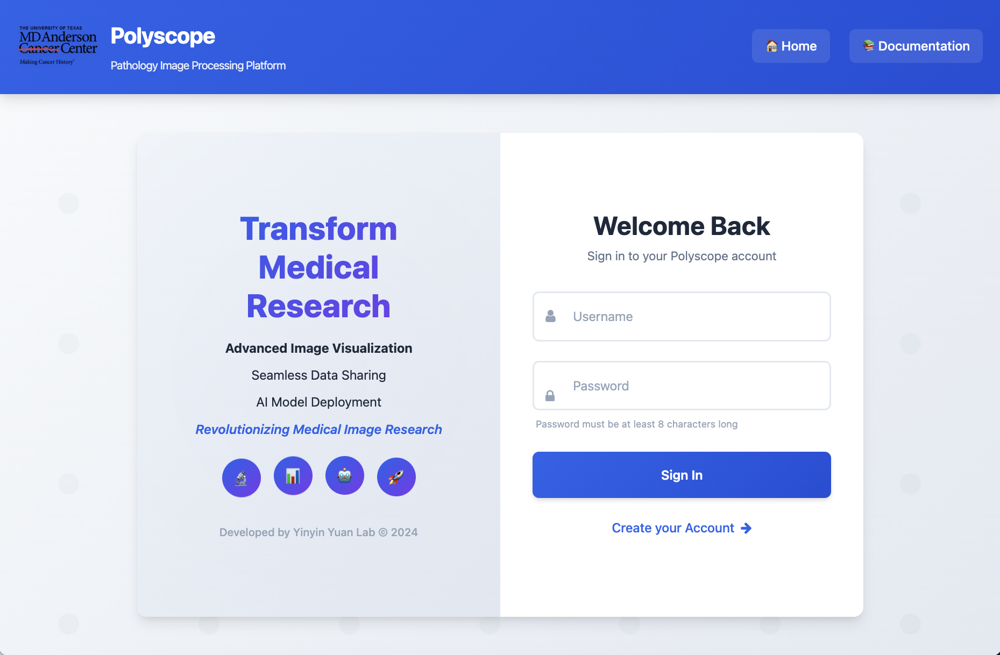

# Tutorial 1: Login, Navigate, Create Polyzoomer

!!! abstract
    This tutorial serves as a quick guide for Polyscope from logging in and uploading files to viewing images.

## Login to Polyscope

Access Polyscope at [(https://polyscope.mdanderson.org/](https://polyscope.mdanderson.org/), which is accessible both within and outside MD Anderson. To log in, enter your MD Anderson username and password at the [Login Page](pages_login.md).

{ width="300" }

## Navigate Folders and Upload/Copy Data

Then, select image files to [upload](pages_index.md#upload-files). Make sure files are within size limit and file formats are supported. Multiple files can be uploaded concurrently. After successfull uploading, you can [organize](pages_index.md#manage-files) files e.g. rename, delete, or create folders. 

## Create Polyzoomer from File

A [Polyzoomer](pages_image.md#view-modes) is an interactive view of an uploaded image, which must be created before viewing. Ensure that file names are properly formatted and that **PHI is removed** before proceeding. Select one or more files and click the **Process to DZI** button to submit files to be [processed](pages_index.md#process-files). 

Processing takes approximately 1 to 10 minutes, which you can check the progress at the [Processing Tab](pages_index.md#processing-tab). Once a Polyzoomer is created, the original source files can be deleted. 

## My Results Page and Open Polyzoomer

The [My Results](pages_results.md) page lists all processed images for each user. Simple [organization](pages_results.md#manage-processed-images) can be done on processed images like source files. Double click on the thumbnail to open a Polyzoomer.

 It is also possible to create a [Multizoomer](pages_image.md#view-modes) from multiple [Polyzoomers](pages_image.md#view-modes), enabling multi-view interaction (see [Tutorial 3](tutorial_multizoomer.md)).

## Explore Polyzoomer

A [Polyzoomer](pages_image.md#view-modes) page provides an interactive view of an image. You can use the mouse and the keyboard to [explore](pages_image.md#view-controls) the images at different locations and zoom levels. The side panel provides additional image adjustment. 

Annotations can be created, viewed, and downloaded directly within Polyzoomer (see [Tutorial 2](tutorial_polyzoomer.md)).

## Share Polyzoomer

A URL link can be generated for [sharing](pages_image.md#link-sharing) the Polyzoomer page. Before sharing, double-check that image file names are properly formatted and **PHI is removed**. The link is accessible to everyone, so keep it confidential. 
